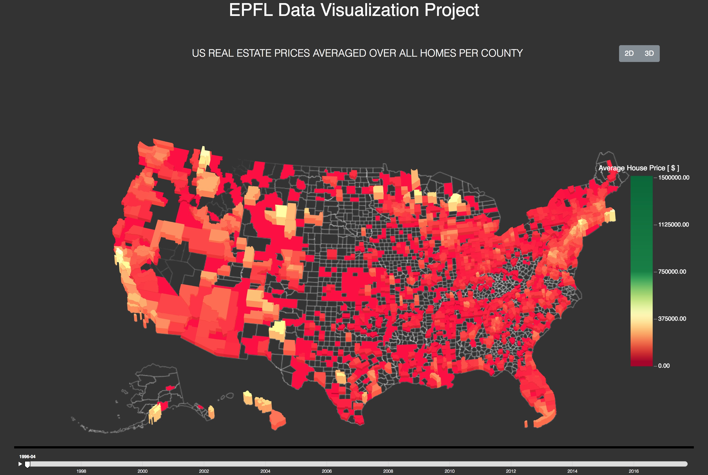

# Data Visualization: Real Estate Map Project

Process Book of Data visualization project at EPFL involving US housing market data.

Team:    
* [Juraj Korcek](https://github.com/korcek-juraj)    
* [Mateusz Paluchowski](https://github.com/PaluchowskiMatthew)    
* [Christian Tresch](https://github.com/raccc)    

Visualization:    
[Real Estate Map Project](http://epfl-dataviz.s3-website.eu-central-1.amazonaws.com)

##### Table of Contents  
[Overview](#Overview)  
[Motivation](#Motivation)  
[Target Audience](#Target_audience)    
[Related Work and Inspiration](#Related_work_and_inspiration)  
[Questions To Answer](#Questions_to_answer)    
[Dataset](#Dataset)  
[Exploratory Data Analysis](#Exploratory_data_analysis)    
[Designs & Deviations](#Designs_&_Deviations)
[Implementation](#Implementation)  
[Evaluation](#Evaluation)  

## Overview <a name="Overview"/>    

The point of this data visualization is to present US house market time data series, spanning through last 20 years.

## Motivation <a name="Motivation"/>    

Insights on changes in the housing market in order to help potential investment decisions in the future based on historical data.

   
## Target Audience <a name="Target_audience"/>

Real estate investors / Market analysts.

    
## Related Work and Inspiration <a name="Related_work_and_inspiration"/>

Inspired by www.trulia.com and interest in real estate market in general. Moreover, this visualization was particularly inspirational.

  
## Questions To Answer <a name="Questions_to_answer"/>   

What am I trying to show in the data viz?    
Changes in the housing prices of the US between 1996-04 and 2017-09.
    
## Dataset <a name="Dataset"/>    
Time series representing prices of household in various US-located zip codes/counties, spanning across aforementioned dates with one month resolution.
[https://www.zillow.com/research/data/](https://www.zillow.com/research/data/)
   
## Exploratory Data Analysis <a name="Exploratory_data_analysis"/>     
Initial Data Analysis consisted of quick and rudimentary data check performed in python, with use of Jupyter Notebooks. Basic histogram plotting amount of data points for each state was performed, as well sanity check for amount of NaN values though the spanning dates for each household. Last but not least, we plotted data in time on simple 2D line plot (for each state) in order to make sure there is 'some story to tell', which we verified is the case, however we want the reader to see it for him/herself. We have also checked the distribtuion of the values. Thanks to this we have found several outliers that would skew a default colormap. Based on this, we have decided to create our own colormap that is robust to outliers. 
    
## Designs & Deviations <a name="Designs_&_Deviations"/>    

#### Initial design 
Initial design of the visualisation considered using D3.js + Leaflet.js as it is the most common tool for map based visualizations. In order to achieve the 3D bars effect, OSMBuildings JavaScript library was used, however with partial success. As the name of the library suggests, it is designed to visualise 3D buildings on a Leaflet map, using provided TopoJson of the buildings. We tried expanding this approach to '3D-fing' entire states, however we stumbled upon the issue where 3D bars were only visible up to certain zoom levels of the map and disappeared in full country perspective. This issue would require a deep dive into both Leaflet.js and OSMBuildings frameworks, in order to fix it should that be possible, thus we decided to find some other approach.

### Second Design
In our second design we considered using pure D3.js and provided topology in TopoJson format. It would require from us to write a custom TopoJson modifier such that each state/county could be '3D-fied' in a way such that it would be 'lifted' as a bar above all the rest, given the current projection on the map. Such solution would be labour intensive and potentially visually unappealing if done incorrectly, thus we quickly decided to use another approach.

### Third Design
In our third - final - design we settled on using D3.js alongside a dedicated 3D framework Three.js.
 
## Implementation <a name="Implementation"/>     

*Describe the intent and functionality of the interactive visualizations you implemented. Provide clear and well-referenced images showing the key design and interaction elements.*

In this part we will describe the route that lead us to the final solution - step-by-step. 

We have started with US county outline in the TopoJson format. We need to convert this to SVG for visualization purposes. FOr that we decided to use topojson-svg tool that is parto of topojson library. However, as topojson-svg hasn't been ported yet to the newest version of the library we had to use the old one - INSERT.VERSION.HERE in particular. 

Once we had the svg we have used three.js library to extrude it into columns. We have drawn inspiration from example found at FILL.IN.ADDRESS. However, there were problems with triangulation resulting in holes in the columns. After quite some investigation, the problem was solved by using not yet officially released version of three.js - technically, a 5-days-old nightly build. 

Afterwards, we have added legend based on the example found at FILL.IN.ADDRESS. This was not without problems either - the legend title and tick labels were missing. After, some investigaion, we have found out that unlike ticks, the tick lbels and title do not change their size according to the legend automatically. Thus, we had to make up for this missing library feature manually.

Then, we have followed this example to find out how to make part of scene moveable and part of scene static. We need this as we di not want the legend to rotate with the mape and to be affect by zoom or pan.    

    
## Evaluation <a name="Evaluation"/>

*What did you learn about the data by using your visualizations? How did you answer your questions? How well does your visualization work, and how could you further improve it?*

Being inspired by the provided NYC population map, initially we wished to visualize each zip code, however due to performance issues we settled on using counties instead. Zip code TopoJson simply consists of way too many arcs and any transformations are CPU intensive resulting in chopped animations. 

## Peer Assessment

### Mateusz Paluchowski

- Preparation – were they prepared during team meetings?    
   Both Juraj and Christian were always ready for the team meetings and have prepared beforehand such that any issues which were needed to be discussed, were resolved at hand without the need to explain anything.
   
- Contribution – did they contribute productively to the team discussion and work?    
   Christian was extremely helpful and contributed a great deal with both dataset knowledge and D3 expertise.
   Juraj proved to be irreplacable particularly when it comes to Three.js code and general development know-how.
   
- Respect for others’ ideas – did they encourage others to contribute their ideas?    
   We had many different visions and initial ideas, yet we still managed to convarge tow a mutual goal. Noone was ever disrespectful or hostile towards others and their ideas.
   
- Flexibility – were they flexible when disagreements occurred?    
   Without flexibility we would have not manage to finish this project at all simple because how different initial visions everyone had.
